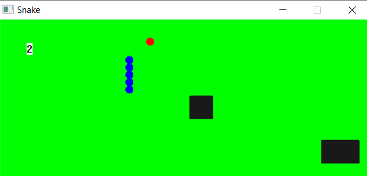

# Classic Snake Game

This is just a small game which I made at the end of [CS101 (Computer Programming and Utilization)](https://www.cse.iitb.ac.in/~cs101/) to gain a better understanding about Object Oriented Programming.   
The game is written in C++ and uses the [`simplecpp`](https://www.cse.iitb.ac.in/~ranade/simplecpp/) package for graphics.